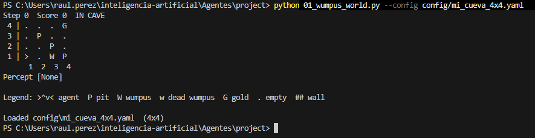
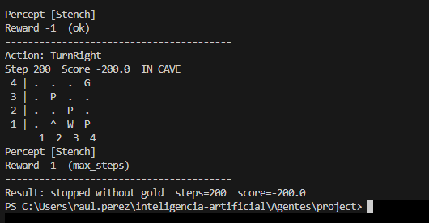
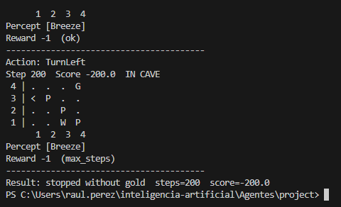
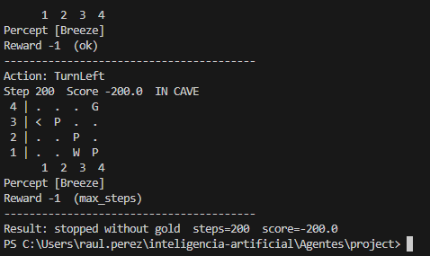
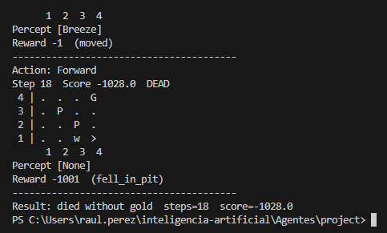
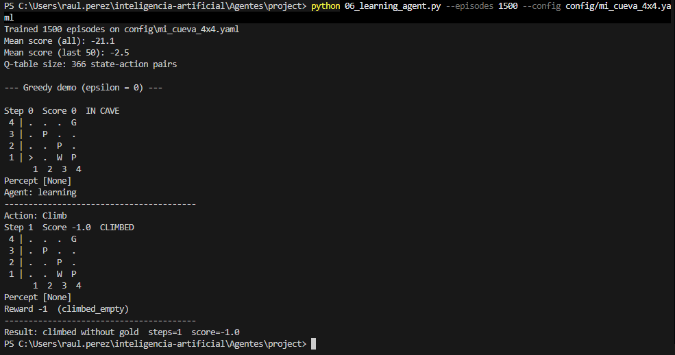

# Reporte de Ejercicio 1 — Mundo del Wumpus

**Curso:** Maestría en Inteligencia Artificial  
**Alumno:** Raúl Alejandro Pérez López  
**Asignatura:** Introducción a la IA  

---

## 1. Configuración de la Cueva (`mi_cueva_4x4.yaml`)

Se diseñó una cueva de cuadrícula 4x4 modificando las posiciones del Wumpus y de los pozos (*pits*) con respecto al mapa clásico (`classic_4x4.yaml`), garantizando la validez de las reglas del entorno:

* **Agente (A):** Inicio en la casilla `[1, 1]`, con orientación `east` y 1 flecha disponible.
* **Wumpus (W):** Ubicado en `[3, 1]` (reubicado de la posición clásica `[1, 3]`).
* **Pozos (P):** Ubicados en `[4, 1]`, `[3, 2]` y `[4, 3]` (reubicados de las posiciones clásicas `[3, 1]`, `[3, 3]`, `[4, 4]`).
* **Oro (G):** Ubicado en `[4, 4]` (reubicado de la posición clásica `[2, 3]`).

### Diagrama ASCII de la Cueva

```text
  Y
4 | .   .   .   G     G = Oro (4,4)
3 | .   P   .   .     P = Pozo (4,1) , (3,2) y (2,3)
2 | .   .   P   .     W = Wumpus (4,1)
1 | A   .   W   P     A = Agente inicio (1,1) mirando al Este
  -----------------
    1   2   3   4   X

```
Una vez definido el entorno se ejecutó `python 01_wumpus_world.py --config config/mi_cueva_4x4.yaml` para la visualización del mismo, cuyo resultado se aprecia en la siguiente imagen:



## Ejecución de los agentes

Ejecutando `python 02_simple_reflex_agent.py --config config/mi_cueva_4x4.yaml`:



Ejecutando `python 03_model_based_agent.py  --config config/mi_cueva_4x4.yaml`:



Ejecutando `python 04_goal_based_agent.py   --config config/mi_cueva_4x4.yaml`:



Ejecutando `python 05_utility_based_agent.py --config config/mi_cueva_4x4.yaml`:



Ejecutando `python 06_learning_agent.py --episodes 1500 --config config/mi_cueva_4x4.yaml`:



### Resultados 

