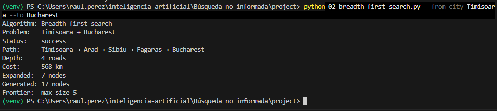
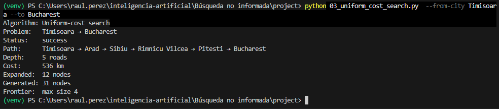
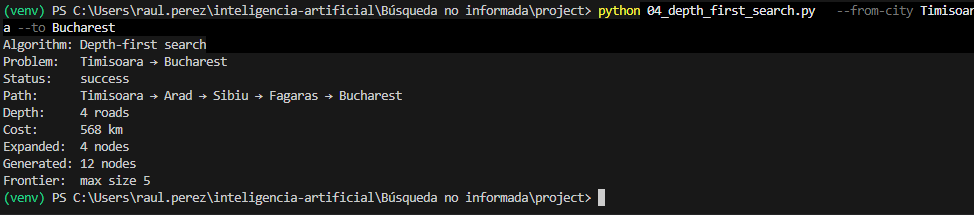
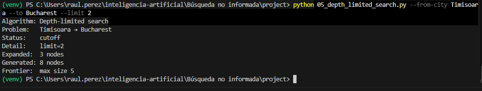
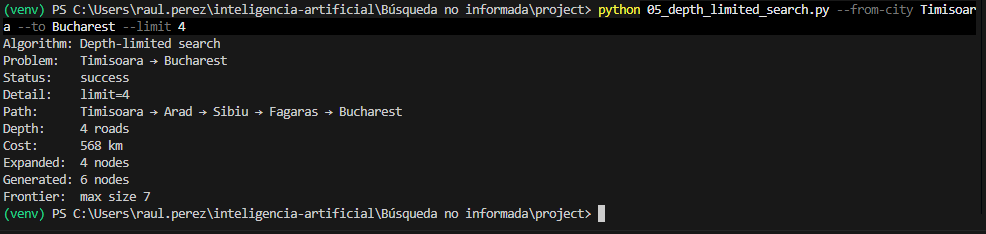
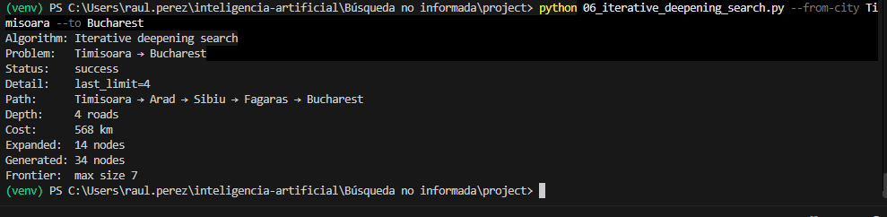

# Reporte de Búsqueda No Informada: Mapa de Rumania

**Asignatura:** Introducción a la inteligencia artifical  
**Tema:** Busqueda no informada  
**Ejercicio:** Ejercicio 1 — Comparación de Algoritmos BFS, UCS, DFS, DLS e IDS  
**Origen:** Timisoara  
**Destino:** Bucharest  

---

## 1. Instancia Elegida y Subgrafo Relevante

Para este análisis se seleccionó la ruta con origen en **Timisoara** y destino en **Bucharest**. 

### Subgrafo Relevante (Distancias en km)


---

## 2. Evidencia de Ejecución de Algoritmos

Se ejecutaron los scripts correspondientes a las distintas arquitecturas de agentes para evaluar su desempeño en el entorno diseñado:

1. **Agente de Reflejo Simple:**
```bash
python 02_breadth_first_search.py --from-city Timisoara --to Bucharest
```


```bash
python 03_uniform_cost_search.py  --from-city Timisoara --to Bucharest
```


```bash
python 04_depth_first_search.py   --from-city Timisoara --to Bucharest
```


```bash
python 05_depth_limited_search.py --from-city Timisoara --to Bucharest --limit 2
```


```bash
python 05_depth_limited_search.py --from-city Timisoara --to Bucharest --limit 4
```


```bash
python 06_iterative_deepening_search.py --from-city Timisoara --to Bucharest
```


## 3. Tabla Comparativa de Resultados

| Algoritmo | Status | Camino (Path) | Profundidad (Depth) | Costo (km) | Nodos Expandidos | Nodos Generados |
| :--- | :--- | :--- | :---: | :---: | :---: | :---: |
| **BFS** | `success` | Timisoara → Arad → Sibiu → Fagaras → Bucharest | 4 | 568 km | 7 | 17 |
| **UCS** | `success` | Timisoara → Arad → Sibiu → Rimnicu Vilcea → Pitesti → Bucharest | 5 | 536 km | 12 | 31 |
| **DFS** | `success` | Timisoara → Arad → Sibiu → Fagaras → Bucharest | 4 | 568 | 4 | 12 |
| **DLS (límite = 2)** | `cutoff` | -- | -- | -- | 3 | 8 |
| **DLS (límite = 4)** | `success` | Timisoara → Arad → Sibiu → Fagaras → Bucharest | 4 | 568 km | 4 | 6 |
| **IDS** | `success` | Timisoara → Arad → Sibiu → Fagaras → Bucharest | 4 | 568 km | 14 | 34 |

---

## 4. Análisis de Resultados

### 1. ¿BFS encontró el camino con menos carreteras? ¿UCS el de menos km?
* **BFS (Breadth-First Search):** Encontró una ruta de **4 carreteras** (`Timisoara → Arad → Sibiu → Fagaras → Bucharest`) con un costo de **568 km**. Al explorar por niveles en amplitud, garantiza hallar la solución con el menor número de saltos.
* **UCS (Uniform-Cost Search):** Encontró una ruta más larga en número de carreteras (**6**), pero óptima en distancia total: **536 km** (`Timisoara → Arad → Sibiu → Rimnicu Vilcea → Pitesti → Bucharest`). UCS expande siempre el nodo con el menor costo acumulado $g(n)$, logrando un ahorro de **32 km** en comparación con BFS.

### 2. ¿Por qué DFS puede devolver un camino más largo aunque el grafo sea el mismo?
* **DFS (Depth-First Search)** explora de manera profunda por la primera rama elegida según el orden de los vecinos, atrapándose en trayectos largos antes de retroceder, sin evaluar ni la profundidad ni el costo en kilómetros.

### 3. Comportamiento de DLS e IDS y relación con BFS
* **DLS con `--limit 2`:** Devuelve `cutoff` debido a que la solución más cercana en número de saltos se encuentra a profundidad 4. Con solo 2 saltos únicamente logra alcanzar nodos como `Arad`, `Lugoj` o `Mehadia`.
* **DLS con `--limit 4`:** Alcanza la profundidad requerida y devuelve la misma solución de 4 saltos que BFS (`568 km`).
* **IDS (Iterative Deepening Search):** Ejecuta búsquedas DLS de forma iterativa incrementando el límite ($l = 0, 1, 2, 3, 4$). Al alcanzar el límite 4 encuentra la solución óptima en carreteras igual que BFS, combinando la eficiencia de memoria de DFS con la optimalidad en saltos de BFS.

---

