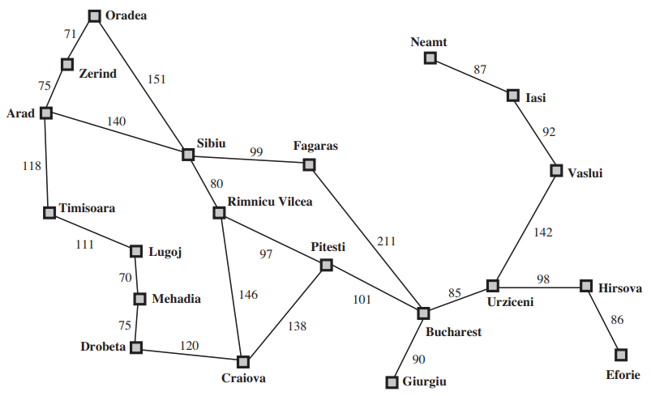
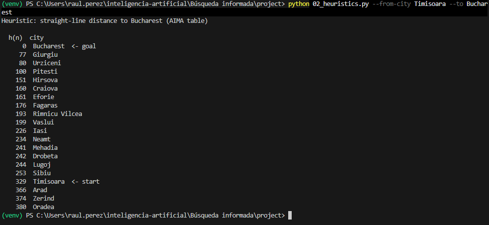
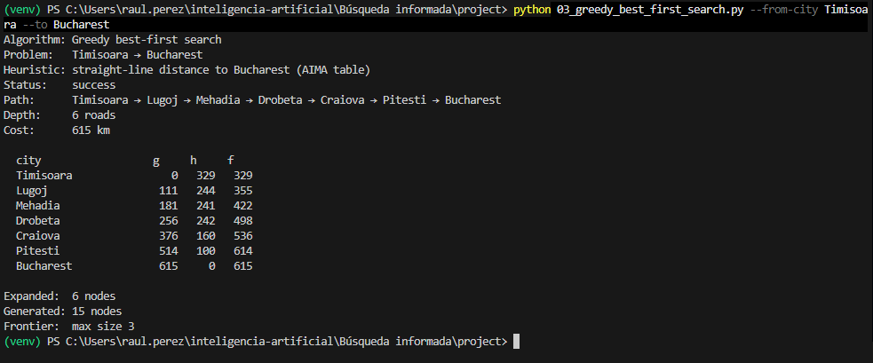
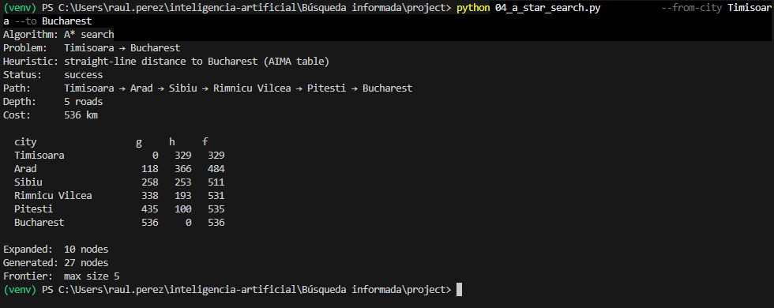

# Reporte de Búsqueda Informada: Mapa de Rumania

**Asignatura:** Introducción a la inteligencia artifical  
**Tema:** Busqueda informada  
**Ejercicio:** Ejercicio 1 — Comparación de Greedy y A* en mapa de Rumania
**Origen:** Timisoara  
**Destino:** Bucharest  

---

## 1. Instancia Elegida y Subgrafo Relevante

Para este análisis se seleccionó la ruta con origen en **Timisoara** y destino en **Bucharest**. 

### Subgrafo Relevante (Distancias en km)



---

## 2. Evidencia de Ejecución de Algoritmos

Se ejecutaron los scripts correspondientes a las distintas arquitecturas de agentes para evaluar su desempeño en el entorno diseñado:

1. **Heuristics:**
```bash
python 02_heuristics.py --from-city Timisoara --to Bucharest
```


2. **Greedy Search:**
```bash
python 03_greedy_best_first_search.py --from-city Timisoara --to Bucharest
```


```bash
[Timisoara]
    | (111)
[Lugoj]
    | (70)
[Mehadia]
    | (75)
[Drobeta]
    | (120)
[Craiova]
    | (138)
[Pitesti]
    | (101)
[Bucharest]
```

3. **A* Search:**
```bash
python 04_a_star_search.py --from-city Timisoara --to Bucharest
```

```bash
[Timisoara]
    | (140)
[Arad]
    | (151)
[Sibiu]
    | (80)
[Rimnicu Vilcea]
    | (97)
[Pitesti]
    | (101)
[Bucharest]
```
## 3. Tabla Comparativa de Resultados

| Algoritmo | Status | Camino (Path) | Profundidad (Depth) | Costo (km) | Nodos Expandidos | Nodos Generados | Heuristic |
| :--- | :--- | :--- | :---: | :---: | :---: | :---: | :---: |
| **Greedy Search** | `success` | Timisoara → Lugoj → Mehadia → Dobreta → Craiova → Pitesti → Bucharest | 6 | 615 km | 6 | 1
5| AIMA Table |
| **A* Search** | `success` | Timisoara → Arad → Sibiu → Rimnicu Vilcea → Pitesti → Bucharest | 5 | 536 km | 10 | 27 | AIMA Table |

---

## 4. Análisis de Resultados

## 1. ¿A* encontró el camino de menos km? ¿Greedy coincidió o se desvió?

* Greedy Search: No encontró el camino de menos kilómetros y se desvió por completo. Se dejó guiar por la distancia en línea recta al objetivo desde Lugoj ($h=244$) frente a Arad ($h=366$), lo que lo obligó a rodear toda la zona sur pasando por Mehadia, Drobeta y Craiova, dando como resultado una ruta de 615 km.
* A Search:* Encontró el camino óptimo de menos kilómetros. Aunque inicialmente evaluó la opción de Lugoj debido a su baja heurística, al calcular la función de costo total ($f = g + h$) recalculó su curso al notar el rápido incremento de los kilómetros reales ($g$). Se desvió a través de Arad y Sibiu para consolidar la ruta más corta posible de 536 km.

## 2. ¿Por qué Greedy puede devolver un camino más caro aunque h sea admisible?
Greedy Search puede devolver un camino más caro porque ignora por completo el costo acumulado del camino ($g(n)$).
Su función de evaluación es únicamente $f(n) = h(n)$. Aunque la heurística $h$ sea admisible (es decir, que nunca sobreestime la distancia real al objetivo), Greedy solo toma decisiones basadas en el "siguiente paso inmediato que parezca más cercano en línea recta". Es decir, no se da cuenta si para avanzar un poco en línea recta está tomando una carretera realmente larga, cayendo fácilmente en desvíos costosos.

## 3. En el camino de A*, ¿f tiende a no disminuir a lo largo de la ruta?
En el camino óptimo la función $f(n)$ tiende a no disminuir (es decir, es monótonamente no decreciente).
Esto se debe a que la heurística en línea recta utilizada en este mapa de ciudades es consistente (o monótona). Cuando una heurística cumple con la desigualdad triangular (el costo estimado desde un nodo no es mayor que el costo real de moverse a un vecino más la estimación de ese vecino), se garantiza matemáticamente que el valor de $f(n) = g(n) + h(n)$ nunca disminuirá a medida que avanzas por la ruta óptima. Cada nuevo nodo descubierto mantendrá el valor de $f$ igual o lo incrementará conforme se revelen los costos reales del terreno.
