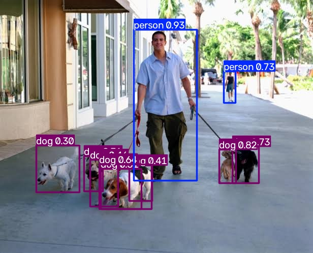

# Reporte: Detección de Objetos y Evaluación de Inferencia con YOLOv8

**Asignatura:** Introducción a la Inteligencia Artificial  
**Alumno:** Raul Alejandro Perez Lopez  
**Tema:** Visión Computacional  
**Ejercicio:** Ejercicio 1 — Cambiar la Imagen de Predicción en YOLO  
**Entorno de Ejecución:** Google Colab  

---

## 1. Ejecución Base e Inferencia con Imágenes Default

El objetivo de este ejercicio es evaluar el comportamiento del modelo de detección de objetos **YOLOv8 nano** (`yolov8n.pt`) preentrenado con el dataset COCO (80 clases). Se ejecutó el flujo completo dentro de Google Colab utilizando la biblioteca `ultralytics`.

### 1.1. Inferencia CLI sobre Imagen de Prueba (`zidane.jpg`)

Se ejecutó la inferencia mediante interfaz de línea de comandos (CLI):

```bash
!yolo predict model=yolov8n.pt source='zidane.jpg'

```


* **Resultados:** El modelo identificó exitosamente:
* **2 personas** (`person`)
* **1 corbata** (`tie`)


* **Comportamiento:** La detección es sólida a pesar del solapamiento de los sujetos y la escala de la corbata respecto al plano general.

### 1.2. Inferencia Python post Fine-Tuning (`bus.jpg`)

Se ejecutó un entrenamiento rápido (*fine-tuning*) de 3 épocas sobre la muestra `coco128.yaml` y posteriormente se realizó la predicción mediante la API de Python:

```python
from ultralytics import YOLO

model = YOLO('yolov8n.pt')  # load a pretrained YOLOv8n detection model
model.train(data='coco128.yaml', epochs=3)  # train the model
model('bus.jpg', save=True)

```


* **Resultados:** El modelo detectó:
* **3 personas** (`person`)
* **1 autobús** (`bus`)
* **1 señal de alto** (`stop sign`)

---

## 2. Inferencia sobre Imagen Personalizada

Para evaluar la capacidad de generalización del modelo frente a un entorno no predeterminado, se reemplazaron los datos de entrada por una imagen personalizada de prueba donde se evalúa la inferencia tanto en la interfaz **CLI** como en el API de **Python**.

### 2.1. Inferencia CLI sobre Imagen Personalizada

```bash
!yolo predict model=yolov8n.pt source='/content/paseador_de_perros.png'

```



* **Resultados:** El modelo detectó un total de 11 objetos:
* **9 perros** (`dog`)
* **2 personas** (`person`)


### 2.2. Inferencia API Python sobre Imagen Personalizada

```python
model('/content/paseador_de_perros.png', save=True)

```


* **Resultados:** El modelo detectó un total de 10 objetos:
* **8 perros** (`dog`)
* **2 personas** (`person`)

---

## 3. Resumen Comparativo de Resultados

| Etapa / Fuente | Método de Inferencia | Imagen de Entrada | Clases Detectadas | Conteo de Cajas | Observaciones del Modelo |
| --- | --- | --- | --- | --- | --- |
| **Base CLI** | Terminal (`!yolo`) | `zidane.jpg` | `person`, `tie` | 3 | Detección limpia de elementos principales sin falsos positivos. |
| **Base Python** | API (`model()`) | `bus.jpg` | `bus`, `person`, `stop sign` | 5 | Reconocimiento preciso en entornos urbanos densos. |
| **Personalizada CLI** | Terminal (`!yolo`) | Imagen Propia | `dog`, `person` | 11 | Alta sensibilidad; identifica 9 perros y 2 personas. |
| **Personalizada Python** | API (`model()`) | Imagen Propia | `dog`, `person` | 10 | Coincidencia en la estructura general, omitiendo 1 perro por umbral marginal. |

---

## 4. Análisis Técnico y Respuestas al Cuestionario

### 1. ¿Qué clases detectó YOLO en las fotos de Ultralytics y cuáles en la tuya?

* **Fotos de Ultralytics:** Detectó las clases `person`, `tie`, `bus` y `stop sign`.
* **Foto Personalizada:** Detectó exclusivamente las clases `person` y `dog`. Todas corresponden a categorías estándar presentes en el conjunto de datos **COCO** de 80 clases.

### 2. ¿Algún objeto evidente de tu foto NO salió etiquetado? ¿Por qué podría pasar?

* **Análisis de Omisión:** En la ejecución con la API de Python, el modelo omitió 1 perro en comparación con la ejecución por CLI (10 vs 11 detecciones).
* **Causas Técnicas:**
1. **Umbral de Confianza (*Confidence Threshold*):** Si la certeza calculada por la red para una caja delimitadora está cerca del límite por defecto (`conf=0.25`), pequeñas variaciones en el estado del modelo post-entrenamiento pueden descartar la detección.
2. **Oclusión y Tamaño del Objeto:** Objetos pequeños, solapados o parcialmente cubiertos presentan menor activación en los mapas de características (*feature maps*) de la red `yolov8n` (arquitectura Nano), reduciendo la puntuación $IoU$ (*Intersection over Union*).
3. **Categorías fuera de COCO:** Cualquier objeto presente en la escena que no forme parte del conjunto de 80 clases entrenadas por defecto será ignorado por la red.


### 3. ¿La predicción de la celda CLI y la de `model(...)` coinciden sobre tu misma imagen?

Coinciden en las **clases principales** (personas y perros en la escena) y en las ubicaciones globales. Sin embargo, existe una pequeña discrepancia en el conteo total de instancias (11 en CLI frente a 10 en Python). Esta diferencia ocurre porque la celda en Python utilizó la instancia del modelo que pasó por las 3 épocas adicionales de fine-tuning (`coco128`), lo que alteró levemente los pesos de la red respecto al punto de control original de `yolov8n.pt` utilizado por el comando CLI.

---

## 5. Evidencias de Ejecución en Google Colab

A continuación se adjuntan las ligas de los notebook utilizados que acreditan el entrenamiento y las inferencias ejecutadas:

### 5.1. Inferencia sobre Muestras Base

* **Github:** [Github 13 YOLO ultralytics.ipynb](https://github.com/RaulLopez1903/MIA_Raul_P./blob/main/Introduccion_a_la_IA/Ejercicios/06_Vision_computacional/13%20YOLO%20ultralytics.ipynb)
* **Colab:** [Colab 13 YOLO ultralytics.ipynb](https://colab.research.google.com/github/RaulLopez1903/MIA_Raul_P./blob/main/Introduccion_a_la_IA/Ejercicios/06_Vision_computacional/13%20YOLO%20ultralytics.ipynb)
