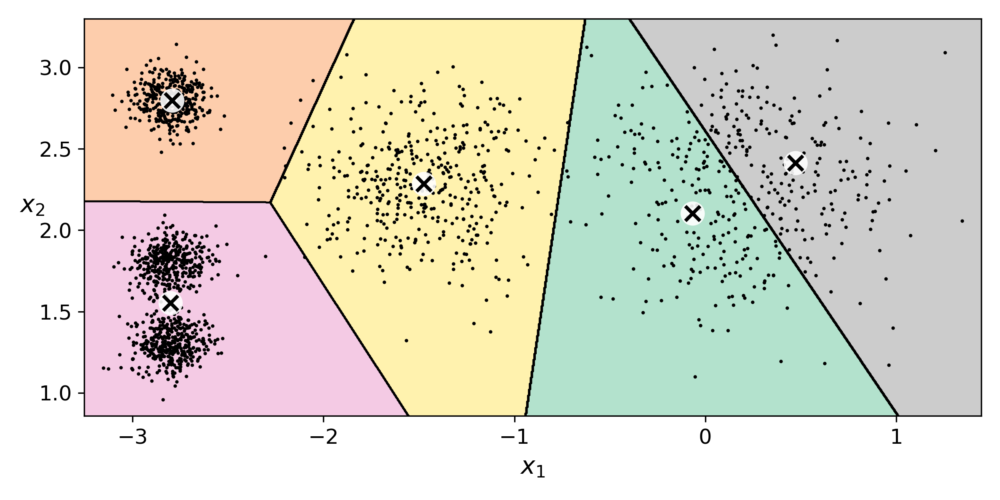
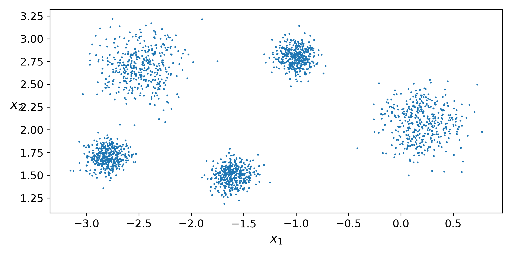
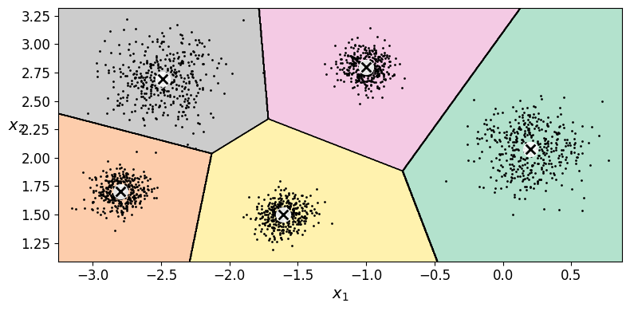
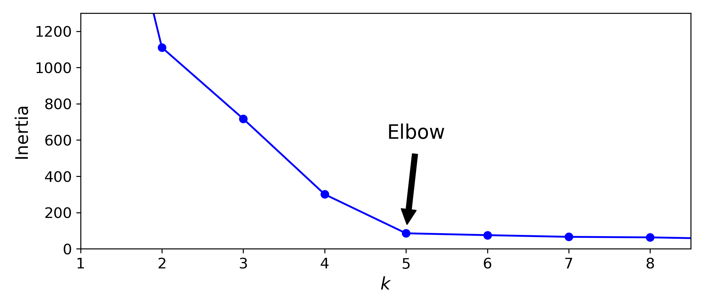
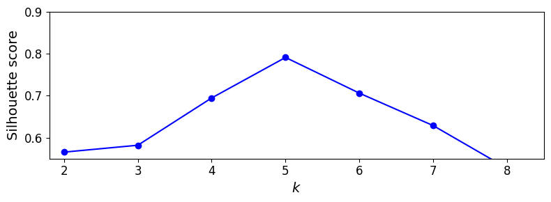
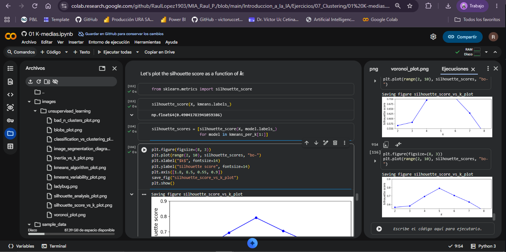

# Reporte

**Asignatura:** Introducción a la inteligencia artificial  
**Alumno:** Raul Alejandro Perez Lopez  
**Tema:** Clustering  
**Ejercicio:** Separar los blobs y volver a elegir \(k\)  

---

## 1. Definición del problema

El presente ejercicio tiene como objetivo analizar el comportamiento del algoritmo **K-means** ante diferentes distribuciones de datos y estudiar cómo la separación de los grupos influye en la elección del número de clusters \(k\).

La notebook ``01 K-medias.ipynb`` genera inicialmente cinco blobs mediante `make_blobs`, utilizando los parámetros definidos originalmente en el ejercicio. Posteriormente, se aplica K-means con diferentes valores de \(k\), utilizando principalmente dos herramientas para determinar un número adecuado de clusters:

- **Método del codo**, mediante el análisis de la inercia.
- **Coeficiente de silueta**, como medida de qué tan bien separados se encuentran los clusters.

En la configuración original, aunque `make_blobs` genera cinco centros, algunos de ellos se encuentran muy próximos entre sí, provocando que ciertas nubes se mezclen. Por esta razón, el número de clusters sugerido por las métricas puede no coincidir con el número de centros utilizados para generar los datos.

En este ejercicio solo se cambiaron los centros y desviaciones estándar, por lo que los demás parámetros se mantienen en ambas ejecuciones.

```python
n_samples = 2000
random_state = 7
```

---

## 2. Ejecución base

Para la primera ejecución se utilizaron los parámetros originales.

```python
blob_centers = np.array(
    [[ 0.2,  2.3],
     [-1.5 ,  2.3],
     [-2.8,  1.8],
     [-2.8,  2.8],
     [-2.8,  1.3]])

blob_std = np.array([0.4, 0.3, 0.1, 0.1, 0.1])
```

Los datos simulados con estas especificaciones se muestran en el siguiente gráfico:


En la distribución original se observan cinco centros, pero los dos grupos ubicados en la zona inferior izquierda y los dos grupos en la zona superior derecha presentan una separación reducida entre sí. Esto provoca que sus observaciones se encuentren relativamente próximas y exista cierto grado de solapamiento.

### 2.1 Diagrama de Voronoi con (k=5)




El diagrama permite observar las regiones asignadas por K-means a cada centroide. Aunque se utilizan cinco clusters, la cercanía entre algunos grupos hace que las fronteras entre determinadas regiones no se reconozcan, mientras que en otras regiones se asignen fronteras por defecto.

Esto permite visualizar que establecer (k=5) no garantiza que los cinco clusters correspondan a grupos claramente separados en los datos.


### 2.2 Método del codo

El método del codo se utiliza para analizar la relación entre el número de clusters (k) y la inercia del modelo.

La inercia representa la suma de las distancias cuadráticas de las observaciones respecto al centroide de su cluster. Al incrementar (k), la inercia disminuye, por lo que el objetivo no es seleccionar simplemente el valor mínimo, sino identificar un punto a partir del cual las mejoras comienzan a ser menores.


A partir de la gráfica se identifica el codo aproximadamente en:

\[
k = 4
\]

En este caso, el codo puede encontrarse en un valor diferente de cinco debido a que algunos de los blobs se encuentran suficientemente próximos como para que K-means pueda representar parte de su estructura mediante un mismo cluster sin generar un incremento considerable de la inercia.

### 2.3 Coeficiente de silueta

El coeficiente de silueta permite evaluar qué tan adecuadamente se encuentra cada observación dentro de su cluster considerando tanto la distancia respecto a su propio grupo como la distancia respecto a los demás grupos.

Valores cercanos a (1) indican una mayor separación entre clusters, mientras que valores cercanos a (0) indican observaciones próximas a las fronteras entre grupos.


El valor máximo del coeficiente de silueta se obtiene para:

\[
k = 4
\]

con un coeficiente de:

\[
S = 0.68
\]

El resultado indica que, de acuerdo con el coeficiente de silueta, la configuración con (k=4) presenta la mejor separación relativa entre los clusters evaluados. Lo que coincide con el método del codo.

---

## 3. Ejecución modificada

Después de analizar la configuración original, se modificaron los parámetros correspondientes a la ubicación de los centros y las desviaciones estándar.

El objetivo de esta modificación fue lograr que los cinco blobs presentaran una separación visual más clara, sin modificar el número de muestras ni los parámetros principales del algoritmo.

### 3.1 Nueva Configuración 

```python
blob_centers = np.array(
    [[ 0.2,  2.1],
     [-2.5 ,  2.7],
     [-1.6,  1.5],
     [-1.0,  2.8],
     [-2.8,  1.7]])
blob_std = np.array([0.2, 0.2, 0.1, 0.1, 0.1])
```

### 3.2. Distribución de los blobs separados



Después de realizar la modificación, se observan grupos de datos claramente acumulados en nubes separadas, esto debido a que, a comparación de la configuración base, definimos esta nueva configuración exactamente para observar que sucede cuando los blobs son de este estilo.

### 3.3 Diagrama de Voronoi con (k=5)



El diagrama muestra la distribución de las regiones correspondientes a los cinco centroides después de modificar los datos.
En este caso podemos observar una separación clara en los grupos de datos y sin solapamientos.

### 3.4 Método del codo después de la modificación



El codo se identifica aproximadamente en:

\[
k = 5
\]

Después de modificar la distribución de los datos, el comportamiento de la inercia presenta un codo muy claro con un aplanado después de k=5, mientras que la configuración base generó un codo en k=4 y además la inercia seguía con pequeñas reducciones después de dicho codo.

### 3.5 Coeficiente de silueta después de la modificación



El valor máximo del coeficiente de silueta se obtiene para:

\[
k = 5
\]

con un valor de:

\[
S = 0.8
\]


Al comparar este resultado con la configuración original nos damos cuenta de que como los grupos de datos están muy bien separados el coeficiente de silueta tiene un nuevo máximo de 0.8, es decir, si reconoce la mejora en la segmentación de datos.

---

## 4. Conclusiones de resultados

A partir de los experimentos realizados, se puede concluir que la distribución de los datos tiene una influencia directa sobre el comportamiento de K-means y sobre la selección del número de clusters \(k\).

En la configuración original, aunque los datos fueron generados utilizando cinco centros, algunos de estos se encontraban demasiado próximos entre sí, provocando cierto grado de solapamiento entre las nubes. Como consecuencia, tanto el método del codo como el coeficiente de silueta identificaron \(k=4\) como la configuración con un comportamiento más adecuado. En particular, el coeficiente de silueta alcanzó un valor máximo de \(0.68\) para \(k=4\).

Esto permite observar que el número de centros utilizado para generar los datos no necesariamente coincide con el número de clusters que K-means identifica como más adecuado. El algoritmo no tiene información sobre la cantidad de centros originales utilizados por `make_blobs`, sino que trabaja con la distribución y las distancias entre los datos. Por lo tanto, cuando dos o más grupos se encuentran demasiado próximos o presentan cierto solapamiento, pueden ser representados de manera más adecuada mediante un mismo cluster.

Al modificar la posición de los centros y reducir algunas de las desviaciones estándar mediante `blob_std`, se consiguió una separación mucho más clara entre los cinco grupos. Esta modificación permitió que las nubes fueran visualmente distinguibles y que prácticamente no existiera solapamiento entre ellas.

Como consecuencia de esta nueva distribución, el comportamiento de ambas métricas cambió. El método del codo pasó de identificar aproximadamente \(k=4\) en la configuración original a identificar un codo claramente definido en \(k=5\). De manera similar, el coeficiente de silueta alcanzó su valor máximo en \(k=5\), aumentando de \(0.68\) en la configuración original a \(0.8\) después de la modificación.

La comparación de ambos experimentos muestra que existe una relación importante entre la distancia de los centros, el valor de `blob_std` y la capacidad de K-means para distinguir los diferentes grupos. Al aumentar la separación relativa entre las nubes y reducir su dispersión, disminuye el solapamiento de los datos y se vuelve más clara la estructura de cinco clusters.

En términos generales, el experimento permitió comprobar que la selección de \(k\) mediante K-means depende de la estructura y distribución de los datos, y no únicamente del número de grupos con el que fueron generados originalmente. En este caso, al mejorar la separación de los cinco blobs, tanto el método del codo como el coeficiente de silueta coincidieron en \(k=5\), haciendo que el resultado del clustering fuera consistente con la estructura utilizada para generar los datos.

---

## 5. Enlaces y evidencia de ejecución

GitHub

[Github 01 K-medias](https://github.com/RaulLopez1903/MIA_Raul_P./blob/main/Introduccion_a_la_IA/Ejercicios/07_Clustering/01%20K-medias.ipynb)

Google Colab

[Colab 01 K-medias](https://colab.research.google.com/github/RaulLopez1903/MIA_Raul_P./blob/main/Introduccion_a_la_IA/Ejercicios/07_Clustering/01%20K-medias.ipynb)

Evidencia de ejecución


