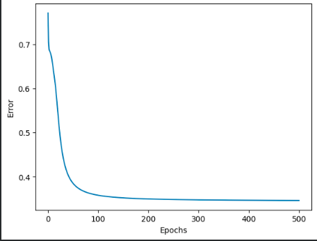
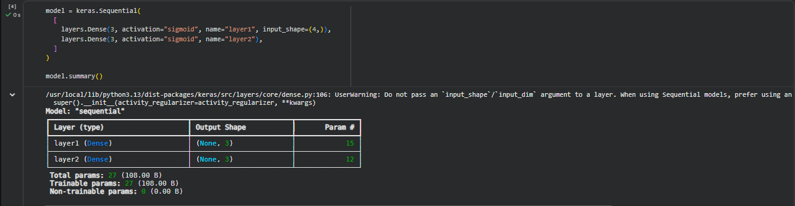
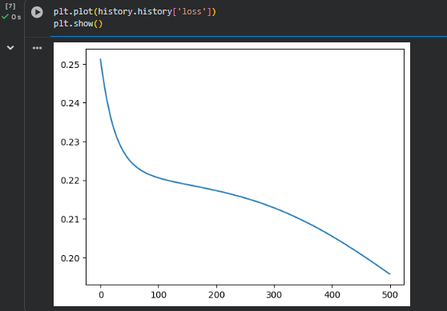
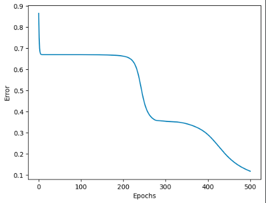
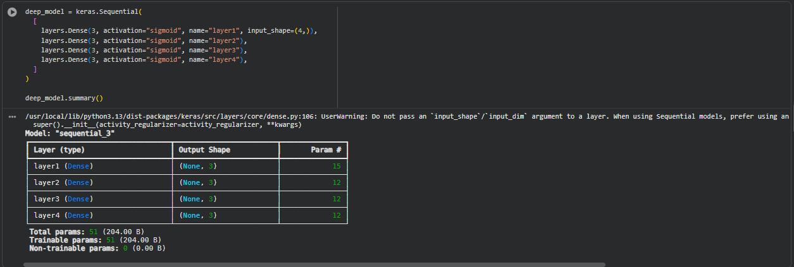
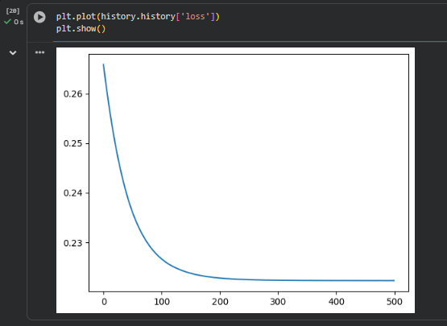

# Reporte

**Materia:** Introducción a la Inteligencia Artificial  
**Alumno:** Raul Alejandro Perez Lopez  
**Tema:** Perceptrón Multicapa  
**Ejercicio:** Más capas en el perceptrón multicapa (Iris)  

---

En este ejercicio realizamos el entrenamiento de redes neuronales multilayer perceptrón en notebooks ``.ipynb`` en **Google Colab**, las redes neuronales se entrenan con la base de datos **Iris** que contiene, para cada tipo de flor **Setosa**, **Versicolor** y **Virginica**, el largo y el ancho del pétalo y sépalo. La finalidad de entrenar estas redes es lograr que se reconozcan los patrones o comportamiento de cada tipo de planta según las medidas del pétalo y sépalo, de manera que, si tenemos nuevos registros sin conocer el tipo de planta (pero si es una de las 3 definidas aquí), la red debería poder predecir cual es el tipo de planta.

## 1. Ejecución de redes default

Entonces, primero entrenaremos una red de 4 entradas, una capa oculta de 3 neuronas y 3 neuronas de salida (una por clase), el proceso será implementar una versión $manual$ en ``Numpy`` y otra "directa" en ``Keras``.  

1. Numpy 
Primero creamos una copia del notebook base ```04 Multilayer perceptron.ipynb```, ejecutamos todas las celdas en el entorno de Colab, con la topología base y obtenemos la siguiente curva de error:



Donde el valor de error reduce gradualmente desde **0.77** hasta **0.34** al final de procesar 500 epocas.

2. Keras
También generamos una copia del notebook base ```05 Keras - multilayer perceptron.ipynb```, con la misma topología se generan 27 parámetros (todos entrenables) como puede verse en al ejecutar:

```bash
model.summary()
```



Mientras que la curva de pérdida se obtiene:

```bash
plt.plot(history.history['loss'])
plt.show()
```



En este caso la pérdida desciende **0.2512** hasta **0.1958**, un aprendizaje $menor$ a comparación del modelo creado con numpy.

3. Interpretación

Puede notarse que las curvas de error tienen un comportamiento distinto, la implementación con numpy inicializa con un error "alto" **(0.77)**, mientras que en keras la pérdida tiene un inicio mucho menor **(0.25)**, aunque el descenso en ambos casos es suave, en numpy se tiene una caída inicial empinada hacia **0.35** en las primeras 100 epocas y luego un descenso mas lento aparentemente sin mayor aprendizaje, mientras que en keras también hay una caída inicial empinada hacia **0.22** en las primeras 100 epocas y un descenso suave pero podemos notar que en las siguientes epocas logra aprender un poco más y reduce el error a **0.19**, una reducción de perdida adicional de 13% (10% adicional que numpy). 

La diferencia en los valores de pérdida iniciales podría deberse a la inicialización de los parámetros, en Numpy se hace aleatoriamente, mientras que Keras puede que tenga una mejor manera de inicializar y por eso la pérdida comienza mucho menor.

---

## 2. Ejecución de redes profundas 

Ahora entrenaremos una red de 4 entradas, tres capas oculta de 3 neuronas y 3 neuronas de salida (una por clase), el proceso será implementar de nuevo la versión $manual$ en ``Numpy`` y la "directa" en ``Keras``.

1. Numpy
La nueva curva de error es:



Podemos ver que el comportamiento de la curva difiere al modelo con solo una capa oculta, vemos un error inicial de **0.86** y una mejora del error final en **0.11**, además de presencia de picos en la grafica y un descenso significativo hasta el final de las 500 epocas.

2. Keras
Al adicionar dos capas ocultas en keras se vuelve más sencillo como añadir:

```bash
    layers.Dense(3, activation="sigmoid", name="layer3"),
    layers.Dense(3, activation="sigmoid", name="layer4"),
```

Donde el summary:



Nos muestra un aumento a 51 parámetros todos entrenables y, al entrenar la red obtenemos una curva de error:



La cual no difiere en comportamiento a comparación de su curva con una capa oculta pero ahora notamos una mayor diferencia a la generada con numpy con su misma topología.

3. Interpretación


---

## 3. Resultados


