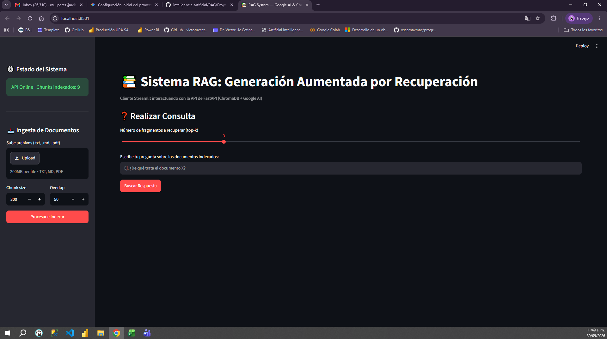
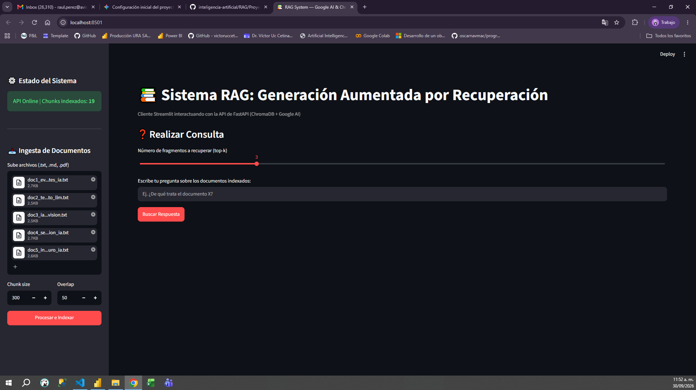
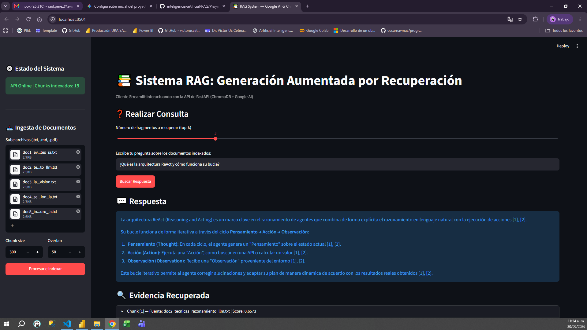
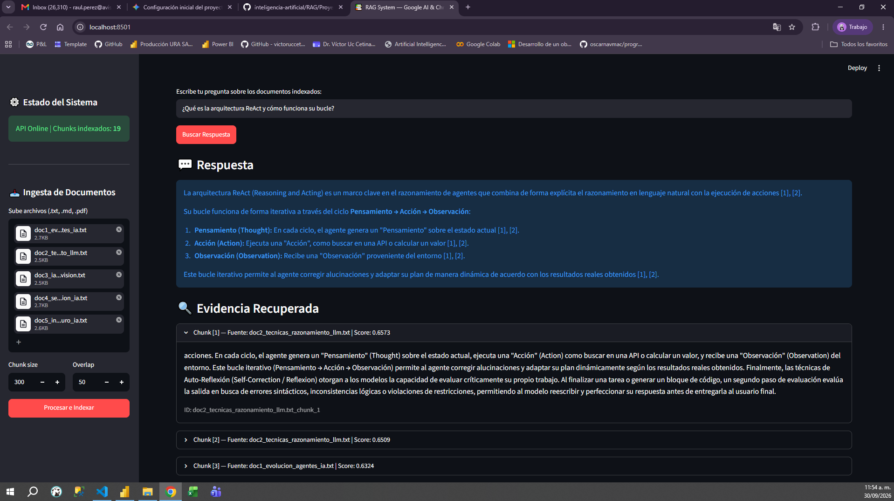
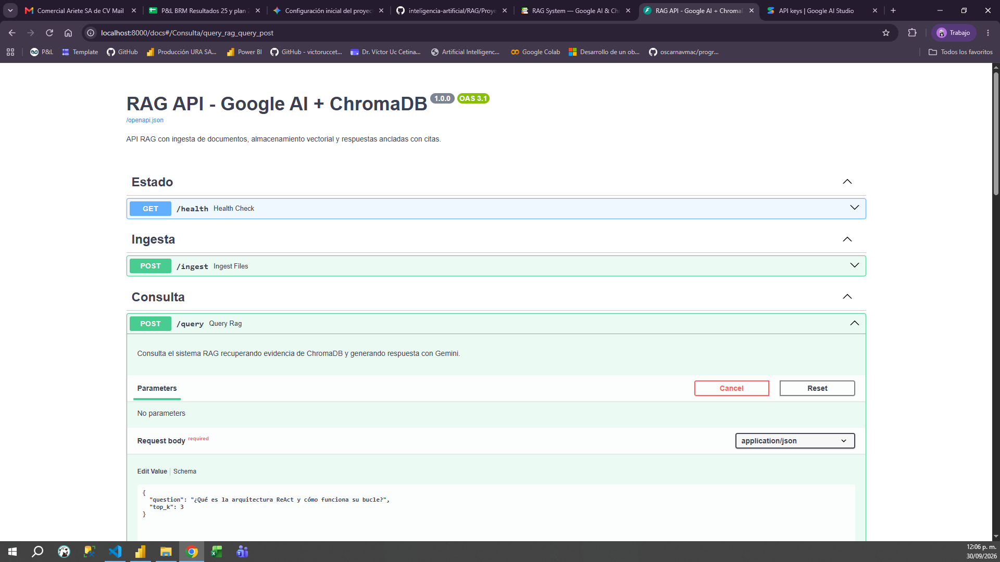
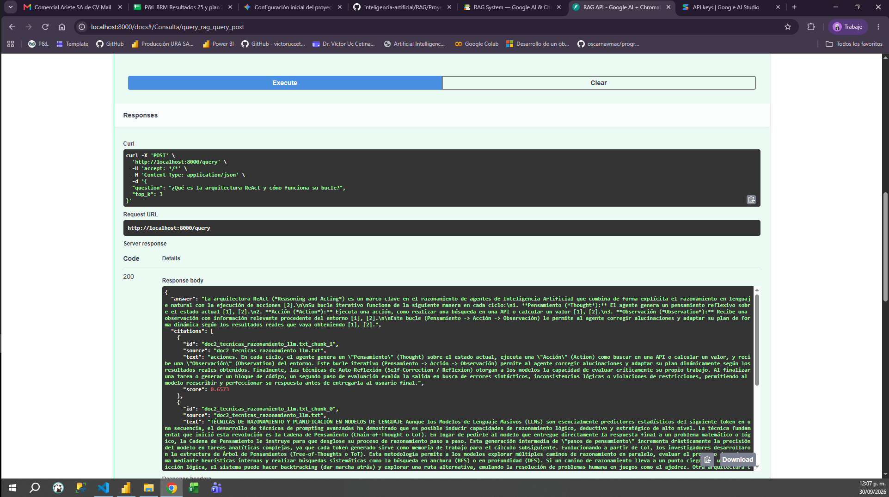
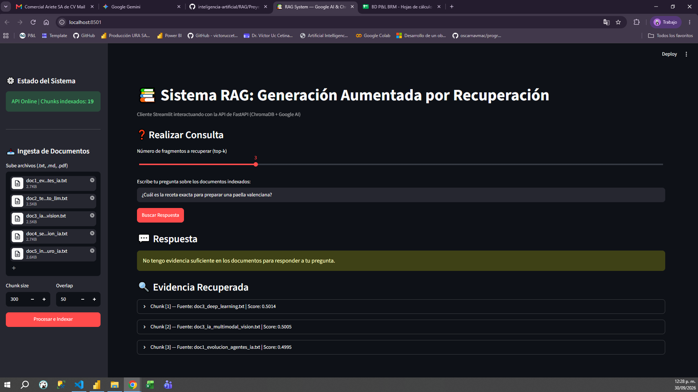

# Reporte Técnico — Sistema RAG (Agentes de IA y LLMs)

**Materia:** Introducción a la inteligencia artificial  
**Alumno:** Raul Alejandro Perez Lopez  
**Tema:** Proyecto final del curso

## 1. Resultados y evidencias del proyecto

El objetivo de este proyecto era armar un sistema RAG (Retrieval-Augmented Generation) funcional de principio a fin, capaz de responder preguntas sobre un conjunto de documentos sin inventar datos ni alucinar.

1. **Arquitectura inicial y separación de capas:**
   Decidimos no mezclar la interfaz con la lógica de negocio. Dejamos a **FastAPI** (puerto 8000) como la API central que habla con los modelos y la base de datos, mientras que **Streamlit** (puerto 8501) quedó únicamente como un cliente HTTP que consume los endpoints `/ingest` y `/query`.

2. **Selección del corpus:**
   Elegimos un tema técnico relevante para probar el sistema: **Inteligencia Artificial Avanzada**. Preparamos 5 archivos `.txt` (`doc1` a `doc5`) que suman algo más de 3,100 palabras. Cubren temas como agentes autónomos, técnicas de razonamiento (*ReAct*, *CoT*), modelos multimodales, seguridad y cómputo.

3. **Primer obstáculo: Límites de cuota (Rate Limits):**
   Al probar las primeras ingestas masivas, la API gratuita de Google AI nos rebotó con un error `429 RESOURCE_EXHAUSTED`. Como los documentos sumaban bastantes palabras, enviar todo de golpe saturaba las peticiones por minuto. Lo resolvimos bajando el tamaño del corpus de 50,000 a las 3,100 palabras en los archivos finales. Con eso los embeddings (`gemini-embedding-001`) procesaron todos los chunks sin fallar.

4. **Persistencia del índice:**
   Guardamos los vectores y sus metadatos (`source`, `chunk_index`) en disco dentro de la carpeta `chroma/`. Esto nos aseguró que al reiniciar el servidor de FastAPI no hiciera falta volver a procesar ni gastar cuota de API reindexando los documentos.

5. **Generación con citas y abstención:**
   Conectamos `gemini-3.6-flash` con un prompt directo: responder en español, citar los fragmentos usados mediante `[n]` y, si la pregunta no se puede responder con el contexto, decir explícitamente que no hay información suficiente.

---

## 2. Pruebas y evidencias de funcionamiento

### Consulta válida desde la interfaz (Streamlit)
Le preguntamos al sistema: `¿Qué es la arquitectura ReAct y cómo funciona su bucle?`

El sistema recuperó los fragmentos relevantes y redactó una respuesta clara citando los puntos clave (`[1]`, `[2]`).

Al desplegar la **Evidencia Recuperada**, confirmamos que la fuente principal fue `doc2_tecnicas_razonamiento_llm.txt` con un score de similitud cosenoidal de `0.6573`.

---

### Verificación del backend desde Swagger (FastAPI)
Para comprobar que la API funciona de forma independiente a la UI, enviamos la misma consulta usando la documentación interactiva en `http://localhost:8000/docs`.

El servidor respondió con código `200 OK`, devolviendo el JSON estructurado con el texto, las citas detalladas y el atributo `"abstained": false`.

---

### Prueba de abstención (Pregunta fuera de dominio)
Para validar que el sistema no inventa información cuando no la tiene, enviamos una pregunta ajena al corpus:  
`¿Cuál es la receta exacta para preparar una paella valenciana?`

El sistema reconoció que los fragmentos no cubrían el tema y devolvió exactamente el mensaje esperado:  
> *"No tengo evidencia suficiente en los documentos para responder a tu pregunta."*

---

## 3. Puntos clave de la implementación

* **Corpus utilizado:** 5 archivos `.txt` sobre Inteligencia Artificial (~3,100 palabras).
* **Chunking y overlap:** Dividimos el texto en bloques de **300 palabras** con un solape de **50 palabras**. Elegimos 300 palabras para mantener los conceptos técnicos completos en un solo bloque y 50 palabras de solape para evitar cortar frases o ideas a la mitad entre un chunk y otro.
* **Criterio de abstención:** Se aplica en dos niveles. Primero, si el score de similitud de los chunks es menor a `0.35`, se descartan. Segundo, mediante el prompt se obliga a Gemini a usar únicamente la evidencia. Si no hay datos suficientes, emite el mensaje de abstención y la API marca `"abstained": true`.
* **División de trabajo en el stack:**
  * **Google AI:** Genera los vectores de 768 dimensiones (`gemini-embedding-001`) y redacta la respuesta final (`gemini-3.6-flash`).
  * **ChromaDB:** Guarda los vectores localmente en disco y calcula los vecinos más cercanos ($k$-NN).
  * **FastAPI:** Maneja los endpoints, el procesamiento de archivos y la lógica de negocio.
  * **Streamlit:** Sirve únicamente como pantalla interactiva para el usuario.